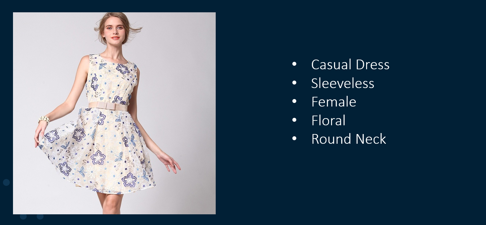
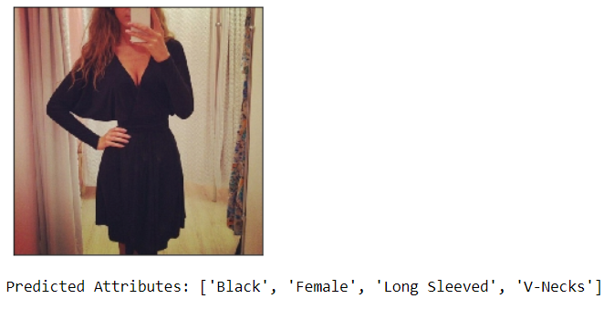
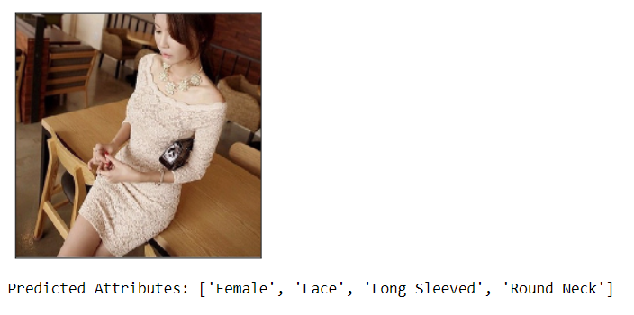
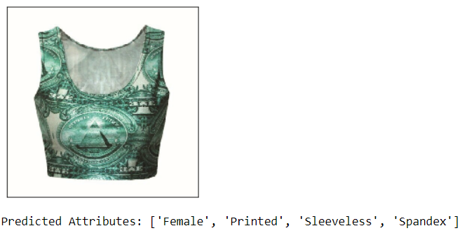
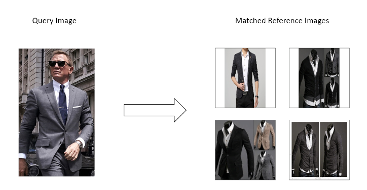
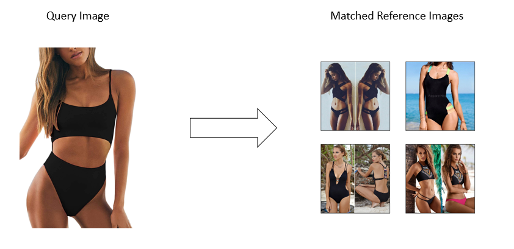
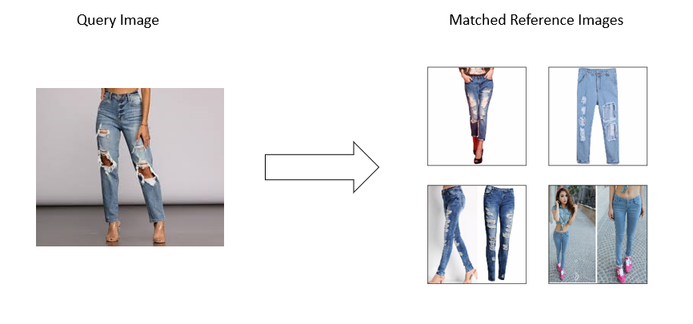

# VisualFashionAttributePrediction
Extraction of fashion product attributes based on their images.

## About This Project
This repository implements my solution of the <a href="https://www.kaggle.com/c/imaterialist-challenge-fashion-2018">Kaggle iMaterialist Challenge (Fashion) at FCVC5 </a>. The competition's goal was to predict attributes of products from the apparel industry based on images of the products. The products are selected from a variety of domains e.g. shoes, jackets, necklaces and many more and the target attributes contain information about the product's category, material, appearance and more. For more information please refer to the competition website.

My personal goal for this competition was to solidify my pytorch skills and to familiarize myself with the <a href="https://github.com/PyTorchLightning/pytorch-lightning">pytorch lightning</a> package, an open-source Python library that provides a high-level interface for PyTorch. For this reason, I solely focused on the training of one model (Resnet50) and did not put much effort into stacking several models together as suggested by the <a href="https://www.kaggle.com/c/imaterialist-challenge-fashion-2018/discussion/57944">winner of the Kaggle competition<a/>.

In addition to the model training pipeline, this repository provides a completely trained model for attribute prediction <a href="https://keeper.mpdl.mpg.de/d/7212e61e34264a2595ac">here</a> and jupyter notebooks for easily scoring new product images and finding the most similar products in a reference dataset, given a query image (see `notebooks` folder). 

The contents of this repository can be used for many applications. An incomplete list of possible topics:

- Analysis of trending attributes
- Competitor Portfolio Analysis
- Intelligent Product Search
- Product Replacements
- Smart Product Recommendation Systems

## Results
### Attribute Prediction
Predicted attributes on the validation set.

For more information please refer to `notebooks/attribute_prediction.ipynb`. If you want to score a pretrained model on own data, please follow the QuickStart instructions below.

### Product Matching
Predicting the attributes of a product based on it's image allows for matching similar products solely based on their visual appearence. In the following, I randomly picked some images from the web and matched them against the validation partition of the iMaterialist Fashion dataset.

For more information please refer to the jupyter notebook `notebooks/product_matching.ipynb`.

## Requirements:
- torch 1.4.0
- pytorch_lightning 1.0.6
- torchvision 0.5.0
- Pillow 7.0.0
- onnx 1.8.0
- onnxruntime 1.5.2

## QuickStart
The following steps will enable you to use a pretrained model to predict the attributes of a fashion product. You can either use example data provided in this repository or test the model on your own images.

- clone the repository
- download some example data by executing the `download_iMaterialistValSet.py`. This will download the validation set of the iMaterialist Dataset. If you want to work with more data, only little changes in `download_iMaterialistValSet.py` and some more files that can be downloaded from the competition website are necessary.
- download the pretrained model weights from <a href="https://drive.google.com/drive/folders/1EdsssrHV3g1cCNSLd2zke3qwBdNVCOjj?usp=sharing">here</a> (not included in repo due to quota constraints)
- download the pretrained model from <a href="https://drive.google.com/drive/folders/1EdsssrHV3g1cCNSLd2zke3qwBdNVCOjj?usp=sharing">here</a>
- open the jupyter notebook `notebooks/attribute_prediction.ipynb`
- follow the notebook instructions

## Model Architecture + Training
The model architecture consists of a standard ResNet50 body that was pretrained on ImageNet and is provided by pytorch. I replaced the fully connected head by a fully connected output layer with shape (2048[output of resnet_body] x 228[number of different features]). As we have a situation in which multiple features can be correct for one sample, instead of a crossentropy loss I use a 228-dimensional binary cross entropy loss.I chose to use a standard Adam optimizer with default parameters and leave it to pytorch lightning to take care of the learning rate schedule. 

I used random color jitter and random horizontal flipping as image augmentation techniques (provided by torchvision.transforms). The images from the iMaterialist Dataset are augmented, normalized (offset: [0.6765, 0.6347, 0.6207], std=[0.3284, 0.3371, 0.3379]) and resized to (512x512).  

I trained the model on 4 nvidia 2080ti gpus with a memory of 11 gb each which allowed me to use a mini batch size of 12. The model converged after 3 epochs (~ 1 day of training).

## Trained Model Weights:
Due to quota limitations on github, I provide trained models on this <a href="https://drive.google.com/drive/folders/1EdsssrHV3g1cCNSLd2zke3qwBdNVCOjj?usp=sharing">link</a> to my google drive. The model is stored in the following formats:

- .onnx
- .chkpt (pytorch lightning checkpoint)
- .pth (pytorch model state dict)
- .sashdat (SAS files)

For instructions on how to load the model, please see the <a href="https://pytorch.org/tutorials/beginner/saving_loading_models.html">official pytorch documentation</a>. Please make sure to use normalized RGB images as input for the model (offset: [0.6765, 0.6347, 0.6207], std=[0.3284, 0.3371, 0.3379]), otherwise the model performance may decrease drastically!

There is an .onnx file for SAS applications specifically. It differs from the other .onnx file in that it's batch size is fixed to 1 which is crucial for importing it into SAS. SAS is an leading multinational developer of analytics software and my former employer. In the `notebooks` directory, you will also find a notebook in which I load the SAS .onnx file, convert it into a SAS model and perform inference with it. The results vary slightly from the ones with open source based model versions. I also exported the model to .sashdat and .astore files and provide them along with the other pretrained model files. 

